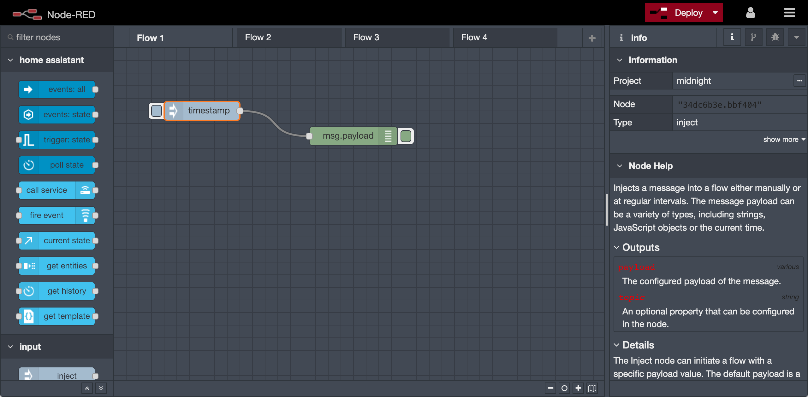

# Bonani's midnight Node-RED theme

![Project Maintenance][maintenance-shield]
[![License][license-shield]](LICENSE.md)

[![GitHub Activity][commits-shield]][commits]
[![GitHub Last Commit][last-commit-shield]][commits]

![GitHub Stars][stars-shield]
![GitHub Watchers][watchers-shield]
![GitHub Forks][forks-shield]

[![Buy me a coffee][buymeacoffee-shield]][buymeacoffee]

## About

<div align="center">
  
</div>

This is a dark theme for [Node-RED][node-red] based on the [midnight theme][ha-midnight-theme] for [Home Assistant][home-assistant].

## Install

Copy `midnight.css` and `theme-tomorrow.js` into the same directory of your `settings.js` file. In my case `/config/node-red`.

Add the folowing to the `editorTheme` section of your `settings.js`

```js
editorTheme: {
    page: {
        css: "/config/node-red/midnight.css",
        scripts: "/config/node-red/theme-tomorrow.js"
    }
}
```

Restart Node-RED.

Enjoy!

## License

MIT License

Copyright (c) 2019 Mauricio Bonani

Permission is hereby granted, free of charge, to any person obtaining a copy
of this software and associated documentation files (the "Software"), to deal
in the Software without restriction, including without limitation the rights
to use, copy, modify, merge, publish, distribute, sublicense, and/or sell
copies of the Software, and to permit persons to whom the Software is
furnished to do so, subject to the following conditions:

The above copyright notice and this permission notice shall be included in all
copies or substantial portions of the Software.

THE SOFTWARE IS PROVIDED "AS IS", WITHOUT WARRANTY OF ANY KIND, EXPRESS OR
IMPLIED, INCLUDING BUT NOT LIMITED TO THE WARRANTIES OF MERCHANTABILITY,
FITNESS FOR A PARTICULAR PURPOSE AND NONINFRINGEMENT. IN NO EVENT SHALL THE
AUTHORS OR COPYRIGHT HOLDERS BE LIABLE FOR ANY CLAIM, DAMAGES OR OTHER
LIABILITY, WHETHER IN AN ACTION OF CONTRACT, TORT OR OTHERWISE, ARISING FROM,
OUT OF OR IN CONNECTION WITH THE SOFTWARE OR THE USE OR OTHER DEALINGS IN THE
SOFTWARE.

[buymeacoffee-shield]: https://www.buymeacoffee.com/assets/img/guidelines/download-assets-sm-2.svg
[buymeacoffee]: https://www.buymeacoffee.com/mbonani
[commits-shield]: https://img.shields.io/github/commit-activity/y/bonanitech/midnight-red.svg
[commits]: https://github.com/bonanitech/midnight-red/commits/master
[contributors]: https://github.com/bonanitech/midnight-red/graphs/contributors
[discord-shield]: https://img.shields.io/discord/330944238910963714.svg
[bonanitech]: https://github.com/bonanitech
[home-assistant]: https://home-assistant.io
[issue]: https://github.com/bonanitech/midnight-red/issues
[license-shield]: https://img.shields.io/github/license/bonanitech/midnight-red.svg
[maintenance-shield]: https://img.shields.io/maintenance/yes/2019.svg
[last-commit-shield]: https://img.shields.io/github/last-commit/bonanitech/midnight-red.svg
[stars-shield]: https://img.shields.io/github/stars/bonanitech/midnight-red.svg?style=social&label=Stars
[forks-shield]: https://img.shields.io/github/forks/bonanitech/midnight-red.svg?style=social&label=Forks
[watchers-shield]: https://img.shields.io/github/watchers/bonanitech/midnight-red.svg?style=social&label=Watchers
[ha-midnight-theme]: https://community.home-assistant.io/t/midnight-theme/28598
[node-red]: https://nodered.org/